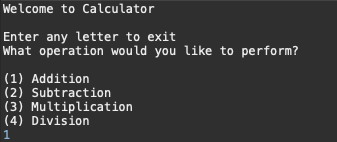
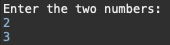
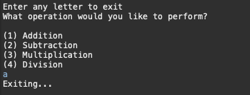

# Calculator

Calculator is a basic arithmatic calculator which performs the four following mathematical operations...

## Features
	- Addition
	- Subtraction
	- Multiplication
	- Division

## Installation
	
	- Clone and pull source code from provided github repository.
	- Compile source code with Java Compiler.
	- Run with Java Runtime Environment.

## Code
	https://github.com/salabha77/Calculator

## Usage
	Once run, the console will welcome and prompt the user for the desired mathematical operation they wish to perform.
	

	The user will then be prompted to enter two numbers that they wish to perform the desired operation on.

	The correct result will then be outputted.

	Calculator will then reprompt the user for another mathematical operation.
	If user is done with the application, enter any letter to exit.

